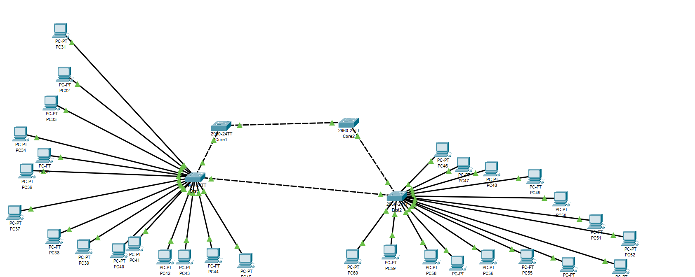

# Parte prática

## 2.1 - Rede projetada



## 2.2 - configuração da vlan

``` swift
enable
conf t
vlan 10
name ADMIN
vlan 20
name FINANCEIRO
vlan 30
name TI
end
```

Core1

``` swift
enable
conf t
interface range fa0/1-2
switchport mode trunk
switchport trunk native vlan 1
exit
```

Core2

``` swift
enable
conf t
interface range fa0/1-2
switchport mode trunk
switchport trunk native vlan 1
exit
```

Dist1

``` swift
enable
conf t
interface range fa0/1-2
switchport mode trunk
switchport trunk native vlan 1
exit
interface range fa0/3-7
switchport mode access
switchport access vlan 10
exit
interface range fa0/8-12
switchport mode access
switchport access vlan 20
exit
interface range fa0/13-17
switchport mode access
switchport access vlan 30
exit
end
write
```

Dist2

``` swift
enable
conf t
interface range fa0/1-2
switchport mode trunk
switchport trunk native vlan 1
exit
interface range fa0/3-7
switchport mode access
switchport access vlan 10
exit
interface range fa0/8-12
switchport mode access
switchport access vlan 20
exit
interface range fa0/13-17
switchport mode access
switchport access vlan 30
exit
end
write
```

## 2.3

### STP

- Root Bridge: Core1
- Portas bloquadas: Dist2 (Fa0/2)
- Portas de encaminhamento: todas as demais portas
- Tempo de convergência: 30-50s

### RSTP

- Root Bridge: Core1
- Portas bloquadas: Core1 (Fa0/2)
- Portas de encaminhamento: todas as demais portas
- Tempo de convergência: 1-5s

### MSTP

não funciona devido ao modelo dos switchs escolhidos

Porém os resultados seriam semelhantes à esses:

- Root Bridge: Core1
- Portas bloquadas: Core1 (Fa0/2)
- Portas de encaminhamento: todas as portas de Core1
- as outras portas são root e designated
- Tempo de convergência: 1-5s
